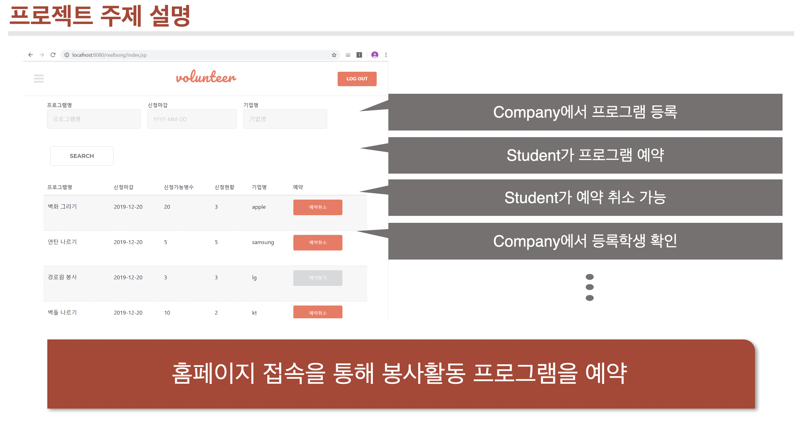
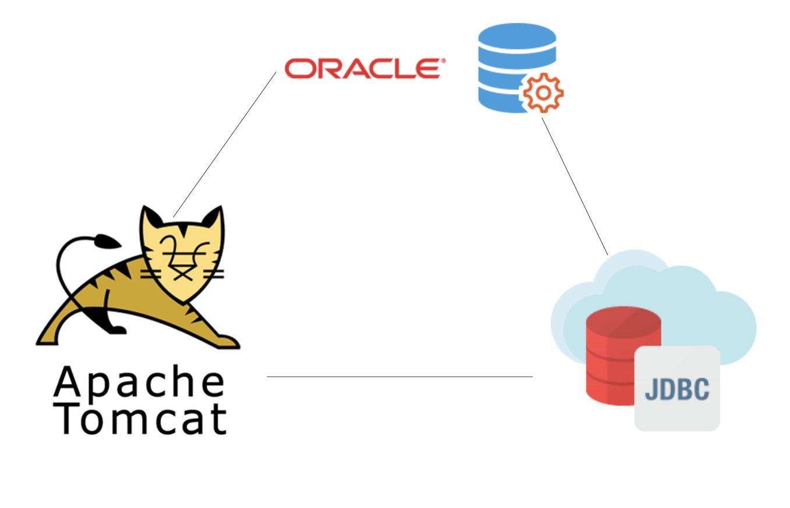
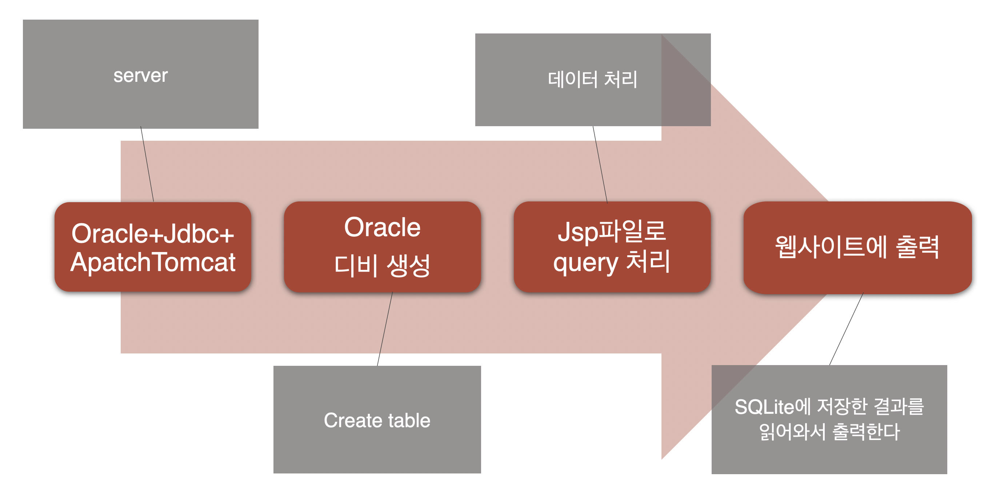
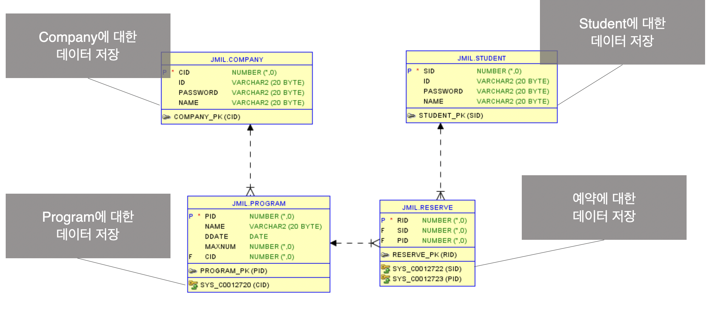

# 봉사활동 예약 시스템
데이터베이스 4조 프로젝트입니다.

## 컴포넌트
>- Oracle (DBMS)
>- Apache Tomcat (Web Application Server)
>- JDBC (Java DataBase Connectivity)

## 데이터베이스 설계

## 시스템 설명
1. 로그인 및 회원가입
- company 혹은 student로 회원가입 가능

> ### student
> 2. 검색기능
>- 프로그램 명, 신청마감 날짜, 기업명으로 검색가능
> 3. 예약기능
>- 프로그램 목록 중에서 예약, 예약취소, 예약불가 확인 및 신청가능
> 4. 내정보
>- 자신이 예약한 프로그램 목록 확인 및 예약 취소 가능

>### Company
> 5. 프로그램 등록
>- 이름, 마감일, 모집인원 입력으로 프로그램 등록가능
> 6. 프로그램 목록
>- 자신의 company에 해당하는 프로그램 조회 및 학생보기 가능
> 7. 학생목록
>- 클릭한 프로그램 예약한 학생 조회 가능

## 데모
- https://www.youtube.com/watch?v=R7MYCIVlrVc&feature=youtu.be

## contributor
- 남태원
- 심재욱
- 이병도
- 정혜진
- 허영행